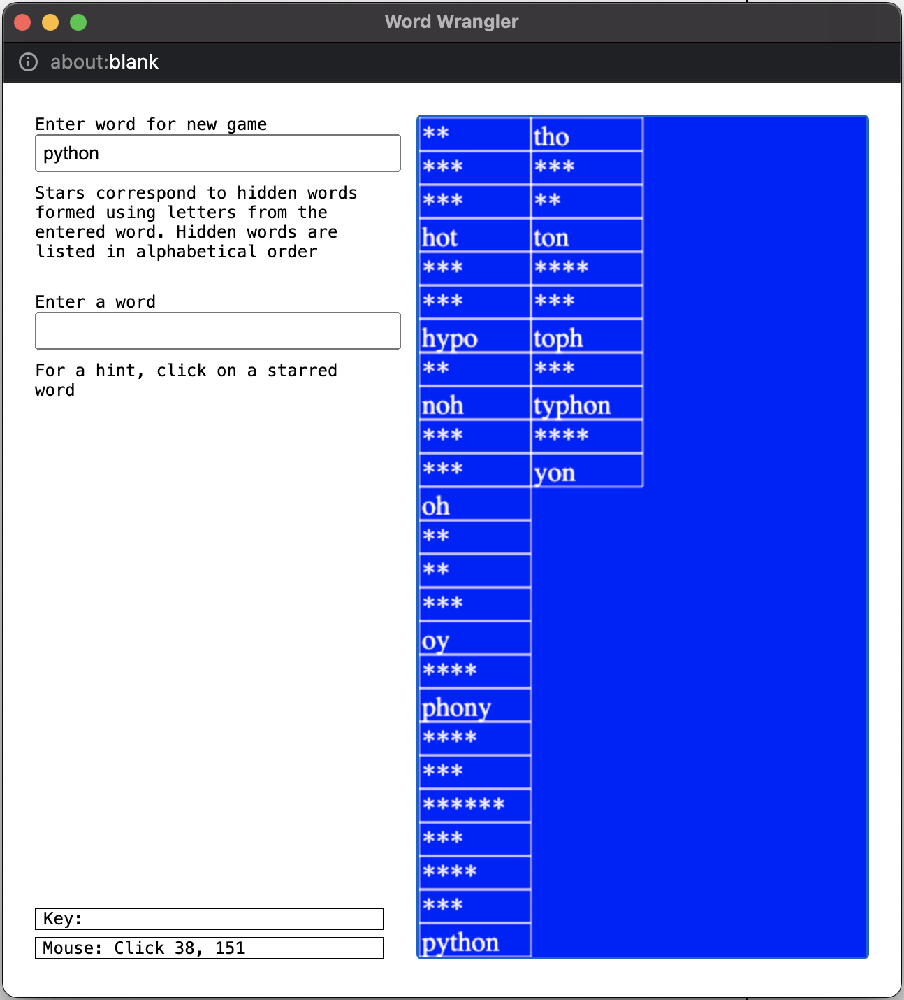

## [Fundamentals of Computing (Rice University, by Coursera)](https://www.coursera.org/specializations/computer-fundamentals) 

This Specialization covers much of the material that first-year
Computer Science students take at Rice University (Houston, Texas, U.S.A.).
Students learn  sophisticated programming skills in Python from the
ground up and apply these skills in building more than 20 fun projects.
The Specialization concludes with a Capstone exam that allows the students
to demonstrate the range of knowledge that they have acquired in the 
Specialization.

The Specialization takes roughly 7 months to complete and is composed of
short lectures, quizzes and assignments. Assignments are required to be
peer-reviewed before advancing to the next stage of the course, and the
student is required to read, understand and review the code of their peers.

Below is a summary of the course content and assignments. Code is not shown
to comply with the course guidelines. I may post my detailed course notes in
a future update.

Verify this certificate at: [coursera.org/verify/specialization/XH7GP9G5SBAB](https://www.coursera.org/verify/specialization/XH7GP9G5SBAB)

---

### [Course 1: An Introduction to Interactive Programming in Python (Part 1)](https://www.coursera.org/learn/interactive-python-1?specialization=computer-fundamentals)

Acquired skills:
* Programming Principles
* Python Syntax And Semantics
* Computer Programming
* Python Programming

<ins><b>Week 1 Project:</b></ins>

Set up a Python environment and use the print() function to print
"We want... a shrubbery!"

<ins><b>Week 2 Project:</b></ins>

Write functions to create a command line game of rock, paper,
scissors, lizard, Spock (a variation of rock, paper, scissors).

<ins><b>Week 3 Project:</b></ins>

Write functions to create a game called "Guess the Number".
The computer chooses a random number within a range specified by the player,
and the player must guess the number with a limit on how many guess they
have. The computer notifies the player if their guess is too high or too low.
When the game is over, the player can then play again.

<ins><b>Week 4 Project:</b></ins>

Write functions to create a game called "Stopwatch". The player starts a
stopwatch and the goal is time pressing the "Stop" button when the number
of seconds is a whole number. The player's score increments by one if
successful. The player can also restart the game.

<ins><b>Week 5 Project:</b></ins>

Re-create the famous video game Pong. Two players can play against each
other using keyboard controls. The game features a scoreboard and a
reset button.

Verify this certificate at: [coursera.org/verify/JTJ8MHJJ7Y8M](https://www.coursera.org/verify/JTJ8MHJJ7Y8M)

---

### [Course 2: An Introduction to Interactive Programming in Python (Part 2)](https://www.coursera.org/learn/interactive-python-2?specialization=computer-fundamentals)

Acquired skills:
* Python Syntax And Semantics
* Logic Programming
* Python Programming
* Object-Oriented Programming (OOP)
* Python Classes

<ins><b>Week 1 Project:</b></ins>

Create a guessing game where there are cards facing down set up in a line.
Each card has a number from 0-9 and the player can only reveal two at a time.
There exist two of each number, and the player must pick cards and try to pick
two that match.

<ins><b>Week 2 Project:</b></ins>

Blackjack Card, Hand, and Deck objects.

<ins><b>Week 3 Project:</b></ins>

Use Python classes to create Ship and Sprite objects.
Laying groundwork for Asteroid.

<ins><b>Week 4 Project:</b></ins>

Create the game asteroids.

Verify this certificate at: [coursera.org/verify/VEFDAW2UL2GY](https://www.coursera.org/verify/VEFDAW2UL2GY)

---

### [Course 3: Principles of Computing (Part 1)](https://www.coursera.org/learn/principles-of-computing-1?specialization=computer-fundamentals)

Acquired skills:
* Computer Programming
* Algorithms
* Python Programming
* Combinatorics

<ins><b>Week 1 Project:</b></ins>

Use OOP in Python to create a BankAccount object which can access functions
such as deposit(), withdraw(), etc.

<ins><b>Week 2 Project:</b></ins>

Use OOP to create the game 2048. The player uses the arrow keys to push
all squares in a 4x4 grid containing a number to one side. If two adjacent squares are
"pushed" into each other and contain the same number, they merge into
one square which is the sum of those two numbers. The goal is to create
one square containing the number 2048.

<ins><b>Week 3 Project:</b></ins>

Create the game Naughts and Crosses (Tic-Tac-Toe) to play against
the computer using a Monte Carlo algorithm.

<ins><b>Week 4 Project:</b></ins>

Create a planner for the dice game Yahtzee. Uses Python functions to
tell the player what the best strategy is depending on their dice roll.

<ins><b>Week 5 Project:</b></ins>

Simulate the game "Cookie Clicker" https://orteil.dashnet.org/cookieclicker/, 
an addictive online game where the player creates a cookie empire through
making cookies with exponentially productive means.
I used the course-provided package "simpleplot" to create a plot that charts
the most economical number of cookies that can be produced in-game.

Verify this certificate at: [coursera.org/verify/GDYXN7R5MMYN](https://www.coursera.org/verify/GDYXN7R5MMYN)

---

### [Course 4: Principles of Computing (Part 2)](https://www.coursera.org/learn/principles-of-computing-2?specialization=computer-fundamentals)

Acquired skills:
* Recursion
* Algorithms
* Python Programming
* Tree (Data Structure)

<ins><b>Week 1 Project:</b></ins>

Create a "Zombie Apocalypse" game. The user can draw obstacles (black),
zombies (red), and humans (green) on a grid. The user can then press a
button to make the zombies chase the humans, or make the humans run from
the zombies based on the most optimal path. When a zombie catches a human,
the zombie turns purple and stays in place.

<ins><b>Week 2 Project:</b></ins>

Create a "Word Wrangler" game/tool. The user enters a word that can be found
in the dictionary, and the game returns a list of words that use some or all
letters from the provided word. The returned list is censored by stars and the
user can click on each word to reveal it.

Makes use of recursion, whereby a number of functions contain within them
the function itself.

<ins><b>Week 3 Project:</b></ins>

Create the game Naughts and Crosses (Tic-Tac-Toe) to play against
the computer again. This time, the computer uses the ["minimax strategy"](https://en.wikipedia.org/wiki/Minimax).

<ins><b>Week 4 Project:</b></ins>

Write an algorithm that can optimally solve a ["15 puzzle"](https://en.wikipedia.org/wiki/15_puzzle).

Verify this certificate at: [coursera.org/verify/7FFVWRUCMVHK](https://www.coursera.org/verify/7FFVWRUCMVHK)

---

### [Course 5: Algorithmic Thinking (Part 1)](https://www.coursera.org/learn/algorithmic-thinking-1?specialization=computer-fundamentals)

Acquired skills:
* Graph Theory
* Algorithms
* Big-O Notation
* Python Programming
* Graph Algorithms

The final assignment involved analysing the efficiency of different
algorithms and graphing their speed using matplotlib.

Verify this certificate at: [coursera.org/verify/Q842KU2JLVWL](https://www.coursera.org/verify/Q842KU2JLVWL)

---

### [Course 6: Algorithmic Thinking (Part 2)](https://www.coursera.org/learn/algorithmic-thinking-2?specialization=computer-fundamentals)

Acquired skills:
* Algorithms
* Python Programming
* Algorithmic Efficiency
* Big-O Notation
* Dynamic Programming

The final assignment involves analysing different clustering algorithms
related to population data.

Verify this certificate at: [coursera.org/verify/229UZRYXWC5C](https://www.coursera.org/verify/229UZRYXWC5C)

---

### [Final Course: The Fundamentals of Computing Capstone Exam](https://www.coursera.org/learn/fundamentals-of-computing-capstone?specialization=computer-fundamentals)

Acquired skills:
* Binary Trees
* Algorithm Design
* Python Programming
* Graphs
* Computer Programming

The final exam involves the student answering a subset of 25 questions
given to them randomly from a large pool of questions. The content of the
exam covers the entirety of the Fundamentals of Computing Specialization.

Verify this certificate at: [coursera.org/verify/HAKMYTR2HDCN](https://www.coursera.org/verify/HAKMYTR2HDCN)

